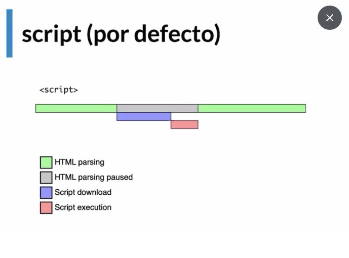
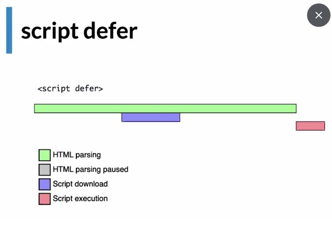
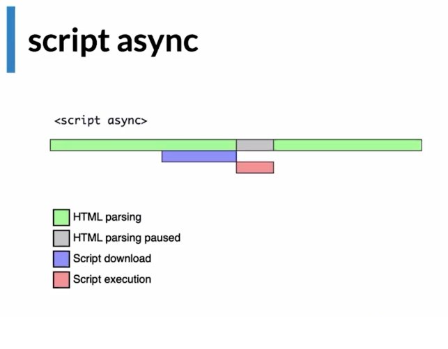

# Optimizacion-Web

## Cuándo realmente un sitio es rápido o lento?
RAIL es un modelo de rendimiento centrado en el usuario que proporciona una estructura para pensar en el rendimiento. El modelo desglosa la experiencia del usuario en acciones clave (por ejemplo, tocar, desplazarse, cargar) y le ayuda a definir objetivos de rendimiento para cada uno de ellos.

Mas info : https://web.dev/rail/ 

### Rail Model
* Response ⇒ Tiempos ideales en las cuales las acciones de nuestras paginas web deberían responder
* Animation ⇒ Animaciones que el sitio web realiza
* Idle ⇒ Tiempos muertos del navegador como ser cargar recursos que no son necesarios al momento
* Load ⇒ Cuando tarda un sitio en cargar, una vez que el usuario ingrese a la URL del sitio

### Tiempos de carga recomendados

* Entre 0 a 300 milisegundos son perfectos 😄
* Desde 1000 milisegundos son buenos 🙂
* Cuando tarda mas de 1500 milisegundos ya el usuario percibe que esta pasando algo malo 😐
* Luego de los 2 segundos todo es malo 🤨

RESUMEN: Cuando tenemos un sitio web lo importante es tener un limite que no exceda los 3 segundos de carga

## 📏 Aprendiendo a medir

lo que no mide, no se mejora

Rail Model:
* Centrado en el usuario
* Métricas de rendimiento basadas en la experiencia de usuario

Entregar el contenido y ser interactiva en menos de 5 segundos

* Esta frase parcialmente es cierta por que debemos recordar que no todos los usuarios tendrán la misma velocidad de internet

Cumplir las métricas para los usuarios del percentil 75%

* No basta concentrarse en un numero concreto si no que consiste en dar un buen recorrido por todas la pagina

RESUMEN: Lo importante es dar una experiencia de usuario en TODO el sitio web.

## 📈 User Performance Metrics
LCP ⇒ Carga

FID ⇒ Velocidad de interactividad

CLS ⇒ Estabilidad de elementos mostrados en el website

Cuando hablamos de experiencia de usuario existen 3 metricas que nos van a ayudar mucho con ello.
* LCP
* FID
* CLS

### LCP [Large Contentful Paint]

Significa el tiempo que tarde en pintar el mayor elemento visible en la ventana

✅ Esta medida sera buena si tarda entre 0 a 2.5 segundos

🟡 Necesita mejora si esta entre 2.5 a 4 segundos

❌ Deficiente de 4 segundos o más

### FID [First Input Delay]
El tiempo que tarda la página en responder a las acciones del usuario

* El tiempo que tarda la página en responder a la primer acción hecha por el usuario.

✅ Esta medida sera buena si tarda entre 0 a 100 milisegundos

🟡 Necesita mejora si esta entre 100 a 300 milisegundos

❌ Deficiente de 300 milisegundos o más

### CLS [Cumulative Layout Shift]

Mide todos los cambios inesperados en el layout de una página

✅ Esta medida sera buena si esta en 0 a 0.1

🟡 Necesita mejora si esta entre 0.1 a 0.25

❌ Deficiente de 0.25 o más

RESUMEN: Debemos usar las métricas que son LCP, FID, CLS para mejorar la experiencia de usuario

## 🧭 Etapas de render del navegador

Critical Render Path. - es el proceso de tomar el código HTML, CSS y JS para convertirlos en pixeles en la pantalla

DOM. - Document Object Model

CSSOM. - un árbol similar al DOM, pero para CSS

### Critical Render Path

 Lo que ha sucedido aquí fue que se construyó el DOM [HTML], CSSOM [CSS], Se renderizo [HTML + CSS], Se hizo el layout [cálculos geométricos] y se pintó en la pantalla [Dibujar los pixeles en la pantalla].


Se compone de 5 etapas.

#### Object Model [etapas 1 y 2]

* Tenemos un index.html
```html
<body>
	<h1>Hallo</h1>
	<p>Hallo</p>
</body>
```

* Tenemos un CSS

```css
h1 {
	color: salmon;
}

p {
	display: none;
}
```

* Se construye el DOM
* Construye un árbol de arriba hacia abajo
* También se construye el CSSOM

#### Render Tree [etapa 3]

  * Seguiríamos teniendo los mismos elementos HTML
  * Solo que en este proceso se distingue que va a pintar y que no

#### Layout | Paint [etapas 4 y 5]

  * Lo primero que hace es ver el ancho disponible para pintar ⇒ Viewport ⇒ width-device
  * Dependiendo del ancho se estima algunas cosas como el box model

## Network waterfall y recursos que bloquean el navegador

Tanto JavaScript como CSS son recursos bloqueantes. Esto quiere decir que cada vez que el navegador encuentra estos archivos, debe parar e interpretarlos mientras sigue haciendo parsing del HTML.

* Script por defecto

bloquea el parsing durante la descarga y ejecución del 



* Script Defer
descarga el script JS pero no lo ejecuta hasta que se finaliza el parsing del HTML.



* Script Async
descarga el script JS durante el parsing y una vez se termine de descargar lo ejecuta inmediatamente, bloqueando solo una “pequeña” parte del parsing.



## 💇 Priorización de recursos

Podemos decirle al navegador que recursos tengan una prioridad mayor con el atributo media en los elementos link, pero se debe tener cuidado porque cada archivo nuevo sera una nueva petición HTTP.

Se debe tener un balance entre lo que necesita la app y como le podemos ayudar al navegador

Todas las herramientas que serán vistas dentro de todo el curso serán de doble filo como podemos ayudar al navegador también podemos hacer que su trabajo sea más duro

* No todos los recursos tienen la misma prioridad
* Por ejemplo, en el CSS pasa que metemos todos los estilos para todos los casos que se pueden llegar a dar
  * Estilos dark mode
  * Estilos de desktop
  * Estilos de tablet
  * Estilos de mobile
* Pénesenos en el caso de alguien que navega en el móvil, el deberá descargar todos estos estilos, así no le sea de interés o relevantes
* Con la priorización de recursos en CSS podemos ayudarle a navegador a darles “pistas” para decirle cual tiene mayor prioridad

```html
<!-- Especificamos el atributo media -->
<link
  rel="stylesheet"
  href="/desktop.css"
  media="screen and (min-width: 600px)"
/>
```

* Esta técnica es simple pero eficiente
* Nos ayuda bastante a decirle al navegador que puede ser importante que cargue y que no
* Se debe considerar que cada vez que hagamos esto sera un nuevo request que debamos hacer hacia el servidor


## 🗃️ Preloading y prefetching de recursos

* Preload. - Recurso que se descargue junto el HTML
* Prefetch. - Recurso que en el futuro se podrá usar
* Precconect. - Conexión anticipada a recursos de servidores remotos

* Podemos decir al navegador cuales son los recursos y dominos que se debe conectar o descargar de forma anticipada
* Existen 3 estrategias para poderlo hacerlo
  * Preload (recursos)
  * Prefetch (recursos)
  * Preconnect (dominios)
```html
<link rel="preconnect" href="https://fonts.gstatic.com/" crossorigin />
<link rel="dns-prefetch" href="https://fonts.gstatic.com/" />
```
  * podemos especificar con el atributo rel las estrategias para realizar este proceso

Si le decimos al navegador de forma anticipada que recursos necesita o a que dominios se puede conectar de una forma anticipada podemos mejorar el rendimiento de nuestros sitios

## 🖌️ Fases Paint y Layout del Critical Render Path

El paint es la operación más costosa que puede hacer un navegador

* Estas etapas son inevitables al momento de cargar CSS y JS
  * Podemos tener cuidado al momento de ejecución de ambos

__Cualquier cambio en una propiedad que no sea opacity o transform genera un Paint__

* Toda la etapa de renderización se puede ver bloqueada y afectada por lo que pase en el paint
* Podemos controlarlo con nuestras animaciones
* Si tenemos cuidado con las animaciones y las reglas del CSS con los elementos de la pagina
  * Podemos ayudar que el navegador reduzca Complejidad y cantidad de procesos que debe hacer para volver a pintar los elementos
* Facebook está consciente acerca de esto al punto que ellos para su navbar usan una sprites antes que una sombra

* Esta técnica es usar una imagen pequeña y multiplicarla varias veces
* Decidieron usar esta técnica debido a que el CSS causaba muchos problemas al momento de hacer scroll

Debemos tener bastante cuidado con el paint debido a que es un proceso bastante pesado y puede afectar a la experiencia de nuestros usuarios para ello podemos usar técnicas como lo hizo Facebook

## 👀 Detectando Paints costosos y optimizando animaciones

Podemos detectar paints costosos con las dev tools integradas de chrome. Tambien podemos reducirlas usando el concepto de Cualquier cambio en una propiedad que no sea opacity o transform genera un Paint y también usando la propiedad will-change de CSS.

* Este tipo de optimizaciones no es algo que se haga al inicio si no que, al momento de detectar el problema, procedemos con la optimización del lugar visto
* Por lo general se trata de CSS y animaciones
* Esto es bastante notable de percibir ya que nuestro sitio web va lento o las animaciones no van fluidas
* Podemos medir los paints costosos con las dev tools en la sección en performance
* Debemos tener siempre en mente que todas las propiedades que cambiarán serán costosas a excepción y el transform
* Podemos preparar al navegador de futuros cambios con la propiedad will-change en CSS

## ⛔ Bloqueos y complejidad en selectores

El CSS puede bloquear recursos importantes como una imagen de un logo. Tambien debemos estar conscientes de no dar selectores complejos para hacer que el navegador haga un menor esfuerzo

BEM es una forma de escribir clases en CSS. Viene de Bloque Elemento y Modificador

* Si no le damos la debida atención al CSS se puede volver complejo a lo largo del tiempo
  * Complejo de mantenimiento en equipo
  * Complejidad para el navegador

* Entre más pequeño sea nuestro CSS, mejor
* Entre menos complejos sean los selectores que usemos, el navegador tendrá que hacer un menor esfuerzo
* Anidar selectores genera más trabajo al navegador .menu > div > img
* Podemos ayudar al navegador usando BEM

  * Nos dará mayor contexto de que bloques estamos editando
  * No daremos selectores complejos por lo cual facilitaremos el trabajo del navegador

* Nuestro código debería tener como máximo 1 solo selector, 1 sola clase y tratar de evitar los id’s

---
* Si deseamos priorizar un recurso en el critical render path lo que deberíamos hacer es ponerlo en una etiqueta img

## 💬 WebFonts y su impacto en rendimiento

* Los webs fonts son bastantes dañinos para el performance
* Puede impactar al punto de que el máximo debería ser 2, Lo recomendable es 1 pero si el rendimiento es crítico entonces no deberías traer web fonts
* En general hay tres formas de cargar fuentes y cada una causa un problem

### 1. Como estilo
* <link> común (i.e.: Google fonts)
* HTML parsing no continúa hasta que se descargue la fuente
* Bloqueante ⇒ Para el parsing del HTML, para descargar la fuente y una vez descargada, se continua con el parsing

### 2. De forma alterna
* Fuente por defecto mientras carga la web Font
* Flash of Unstyled Text (FOUT)
* Ese cambio genera un parpadeo, el cual es perceptible para los usuarios

### 3. Luego del HTML parsing
* No mostrar texto hasta que se descargue la fuente
* Flash of Invisible Text (FOIT)

-------

* Google Fonts en las últimas versiones nos permite tener una fuente por defecto hasta que se cargue la que deseemos poniendo en el link &display=swap
* Tambien podemos hacerlo con una librería open source llamada web font loader
  * Esta librería nos brinda eventos de los estados de nuestras fuentes a través de clases

Las webs fonts son recursos pesados y tienen bastante costo a nivel de performance, debemos tener un límite de dos fuentes y debemos tomar en cuenta todas las estrategias que tenemos para cargarlas.

Links:
* https://www.zachleat.com/web/css-tricks-web-fonts/
* https://github.com/typekit/webfontloader 


## 🖼️ Imágenes, formato y compresión

* __GIF__ es el único formato que nos permite animar imágenes
* __PNG-8__ utiliza el color de 8 bits. Al igual que el formato GIF, el formato PNG-8 comprime eficazmente áreas de color uniforme a la vez que mantiene los detalles nítidos, como los que hay en líneas, logotipos o texto.
* __JPG__ es un formato de compresión de imágenes, tanto en color como en escala de grises, con alta calidad.

Herramientas en linea:
* Para editar imagenes : https://www.photopea.com/
* Para reducir el peso de las imagnes: https://tinypng.com/

Las imágenes son las formas es la forma más fácil, y segura, de reducir el tamaño de una pagina
Se recomienda que pesen 70 kb, pero con el tiempo en los mobiles creció en promedio hasta 900 kb y en escritorio hasta 1 MB

### Reducir peso de imágenes
__Only__
* TinyPNG

__API__
* Cloudinary
* Netlify
* TinyPNG

__Dev Flow__
* Webpack
* Grunt
* Gulp
* post-commit

### Formatos de compresión

__Los más populares__
* GIF
* PNG (y PNG-8)
* JPG

### GIF
* Es un formato liviano
* 256 colores
* No degradados
* Perfecto cuando hay pocos colores, colores planos y sin transparencia

### PNG-8
* Nos da todas las ventajas de GIF + transparencias
* Perfecto para íconos y algunos logos

### PNG (24)
* PNG-8 + colores ilimitados
* Imágenes con degradados o muchos colores con transparencia

### JPG o JPEG

* Nos sirve para fotografías
* Millones de colores
* Degradados
* Sin transparencia
* Tiene dos modos de progresión de carga
  * Progresivo
  * No progresivo
* Siempre sera bueno dar un JPG progresivo

RESUMEN: Las imágenes son una manera fácil y segura de optimizar los sitios web, ya que podemos analizar como las estamos usando y podemos utilizar herramientas ya sea para reducir el tamaño en medida del mismo o para optimizar el peso que tiene.


## 🎨 ¿WebFont, Imagen o SVG?

Una imagen es una matriz dividida en cuadrados cada uno, es la representación de un pixel

SVG o vectores son elementos generados matemáticamente por el navegador

Above the fold primeros 500 a 600 pixeles de la pantalla, es la parte más importante porque es lo primero que ven los usuarios

### Imagen vs Vectores

Si aplicamos zoom a cada uno
* Imagen ⇒ Se verán los pixeles
* Vector ⇒ Mantendrá la calidad

### Web Fonts

__Ventajas__

* Son prácticos
* Fáciles de usar y distribuir

__Desventajas__
* Un recurso más
* HTTP Request
* Bloqueantes
* No son accesibles

### SVG

__Ventajas__

* Livianos
* Inline en el HTML
* Accesibilidad
* Animaciones
* Data URI

__Desventajas__

* Se quita facilidad
* Requiere un diseñador
* Incrementa el largo del HTML ⇒ Puede ser incómodo para el equipo de trabajo, pero para el navegador no

__¿Cuándo usarlos?__

* Logos (especialmente “Above the fold”)
* Ilustraciones
* Ilustraciones animadas
* En general: gráficos de los que puedas mantener un fácil control

Tenemos dos opciones las webfonts que son bastantes fáciles y practicas al momento de usarlas, pero implican un recurso más que pedir mediante HTTP, volviéndolo bloqueante a nivel de performance, una alternativa es un SVG que nos da una mejor accesibilidad, pero la desventaja es que puede llegar a ser extenso en HTML, solo afectando un poco a la experiencia de desarrollo

## 👨‍🚀 Técnicas avanzadas con Lazy Loading

Intersection observer es una API del navegador la cual ve cuales son los elementos visibles del documento y según a esa información genera eventos

* Existen lazy loading de carga y de progresión
* Medium aplica una técnica de lazy loading en las imágenes
  * Al principio nos aparecerá una imagen borrosa y pixelada hasta que la tengamos lista y sea visible en pantalla
  * Ira progresivamente mejorando la imagen
* El lazy loading de carga, trata de cargar las imágenes cuando la imagen sea de carga
  * Esto es conveniente para ahorrar recursos a los usuarios
* Existen tres formas de hacer lazy loading de carga

### De forma nativa

El navegador se encargará de hacerlo de forma automática

```html

```

__Ventajas__
* Nativo
* Facil
* Conveniente
* Video, iframes

__Desventajas__
* Es tan nuevo, que tiene poco soporte (actualmente)

Mas info : https://caniuse.com/?search=lazy 

### Intersection Observer

__Ventajas__
* Técnicamente más correcto (luego de nativo)
* Relativamente fácil

__Desventajas__
* No soportado por internet explorer
* Versión 2 en proceso

### Scroll Listener
__ventajas__
* Soportado en todos los navegadores

__Desventajas__
* Scroll listener
* Muchos cálculos por evento

RESUMEN: Para poder cargar las imágenes dinámicamente tenemos diferentes alternativas, en cada una debemos considerar el soporte que tiene con los navegadores y como lo implementaremos en el proyecto

Link:
* Ejemplo funcional del IntersectionObserver: https://codesandbox.io/s/eloquent-joliot-wcc52
* Libreria de Lazy Loading: https://github.com/ApoorvSaxena/lozad.js 

## 📲 Técnicas avanzadas con Responsive Loading

Una imagen de 300 kb
Un usuario que se conecte con un dispositivo de gama alta con una red 5G va ser diferente con un usuario de gama baja con una red 2G

_Como ayudamos a que nuestros usuarios tengan la mejor imagen sin importar su conexión y dispositivo_

* Es ahi donde viene el responsive loading el cual se encarga de esta tarea
* Esto nos ayuda a cargar imágenes según el tamaño del dispositivo
* Existen servicios o librerías como cloudinary o Gatsby el cual nos ayudan a usar esta característica

Podemos mejorar la experiencia de usuario con las imágenes brindando soporte para diferentes tamaños de dispositivo a las imágenes y que estas carguen la resolución y el tamaño según a este criterio

## 💖 JavaScript y aplicaciones modernas y Utilizando un servidor de producción

* Web moderna está basada en JavaScript
* Muchas veces no somos conscientes al momento de instalar muchas dependencias, estamos creando una mala experiencia para los usuarios
* En el 2018 se estimó que el tamaño medio de los sitios web esta alrededor de 350kB [Tamaño moderadamente aceptable]
  * El tiempo de espera para que una aplicación sea interactiva tarda más de 15 segundos

_Si el JavaScript de lado del cliente no está beneficiando a la experiencia de usuario, pregúntate a ti mismo, si realmente es necesario_

* Webpack en modo de desarrollo no realiza ninguna optimización de código
* Lo que haremos sera:
  1. Compilar webpack en producción
  2. Utilizar un servidor listo para producción

* Si ponemos -p en webpack hace dos cosas
  * Pone NODE_ENV=production a node
  * Pasa el parámetro mode=production a webpack

RESUMEN: Es importante tomar en cuenta el modo de producción para analizar si vamos bien con nuestro JavaScript a nivel de performance

Recursos: https://v8.dev/blog/cost-of-javascript-2019

## 🔍 Analizando el bundle de la aplicación

* webpack tienen herramientas y plugins que nos ayudan a analizar el bundle del JS
* Podemos usar webpack bundler analyzer para analizar y tener una medida exacta de que está pasando dentro del bundler a través de una grafica

Podemos verificar el tamaño de nuestras dependencias y nuestro código a través de herramientas de análisis de tamaño

Mas informacion:
* Webpack Bundle Analyzer : https://github.com/webpack-contrib/webpack-bundle-analyzer 

* Analisar paquetes de npm : https://bundlephobia.com/ 


##  ⬇️ Reduciendo el tamaño del bundle

bundle Phobia : https://bundlephobia.com/ 

* Podemos usar soluciones online para analizar que puede estar pesando dentro de nuestra aplicación una de ellas es bundle Phobia
* Existen librerías que son “Tree Shakable”
  * Ayudan al empaquetador de solo sacar lo que se necesitan
* Nos podemos ayudar de bundle Phobia para encontrar paquetes que sean más pequeños a la hora de hacer el bundle de nuestra aplicación

Para reducir el tamaño de nuestro bundle es importante tomar en cuenta las dependencias que usamos y encontrar la forma de reducir el tamaño ya sea usando las funciones necesarias si es que la libreria es tree shakable o buscando una alternativa liviana

##  🏹 Code Splitting

Code splitting por paginas es una manera de hacer code splitting el cual consiste en cuando el usuario cargue una página en específico el bundle que se enviara al navegador sera una sola fracción y lo que esa página necesite

* Si bien podemos reducir el tamaño de nuestros bundle, llegará un momento donde no tendrá más reducción
* En ese momento debemos tomar otras estrategias y el code splitting es una de ellas
* En vez de tener un bundle gigante de nuestra aplicación, lo que hace el code splitting sera dividirlo en diferentes partes para que sea mucho más fácil y pese menos a la hora de enviarlo al navegador
  * Frameworks como Angular, Next y Gatsby se genera un code splitting basado en paginas
* Otra técnica es dividir el código de las librerías [vender] de nuestro bundle final
  * Esta técnica es beneficiosa en el sentido de que los navegadores hacen cache de los archivos, por lo cual los vendors se quedaran en cache ya que estos no se suelen actualizar mucho.
  * Como efecto reduciremos la cantidad de requests

RESUMEN: Podemos ver que el code splitting es dividir el código, es beneficioso el uso que se le quiera dar, ya que se puede implementar de diferentes formas

Links:
* Optimization en Webpack : https://webpack.js.org/configuration/optimization/ 

## Lazy Module Loading

1. instale dependencia:

```
npm install lozad -S
```

2. Creamos en la carpeta src del proyecto la carpeta modal y dentro de modal se creó el archivo index.js.

3. en src/modal/index.js se escribió:
```js
export const modalListener = (event) => {
    event.preventDefault();
    const img = event.target
    const link = img.parentElement;
    console.log(link.href);
}
```

4. en src/index.js se agregó el siguiente código:
```js
import lozad from 'lozad';
import { modalListener } from './modal';
...
...
    .insertAdjacentElement(
      'afterend',
      Carousel({
        itemsList: popular,
      })
    )

    /* ENTRE ESTA LINEA!! */

    // Add lazy loading
    const carouseImages = document.querySelectorAll('.carousel-item__img');
    const observer = lozad(carouseImages);
    observer.observe();

    const allYouTubeLinks = document.querySelectorAll('.js-video-link');
      // console.log(allYouTubeLinks);
      allYouTubeLinks.forEach((link) => {
        link.addEventListener('click', modalListener);
    });

    /* Y ENTRE ESTA LINEA */
})(document, window)
```
5. y por ultimo se agrego en el archivo CarouselItem.js:

SE AGREGÓ EL ATRIBUTO CLASSNAME A LA ETIQUETA ‘a’, este código comienza como en la linea 8, al menos en mi editor.

```js
const Controls = ({ slug, youtubeVideoId }) =>
  h(
    'div',
    h(
      'a', // esta 'a' ó 'a.js-video-link y QUITAMOS EL ATRIBUTO className'
      {
        className: 'js-video-link',
        href: `https://www.youtube.com/watch?v=${youtubeVideoId}`,
        title: 'Watch trailer',
        target: '_blank',
        rel: 'noreferrer',
      },
```